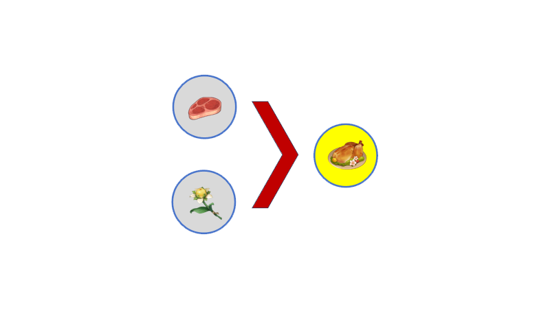

# Cusine

大部分菜肴由多个食材经过烹饪而来(香肠除外). 菜肴无需再进一步加工, 请将他交给你的宝享用吧!

Most dishes are *cooked* from multiple ingredients(except sausages). The dish needs no further processing, please give it to your customers to enjoy!

|Icon       |Name        |Recipe|
|-----------|------------|------|
| | ? |  |
| | ? ||
| | ? ||
| | ? | |
| | ? |  |
| | ? |  |

