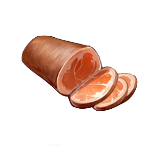
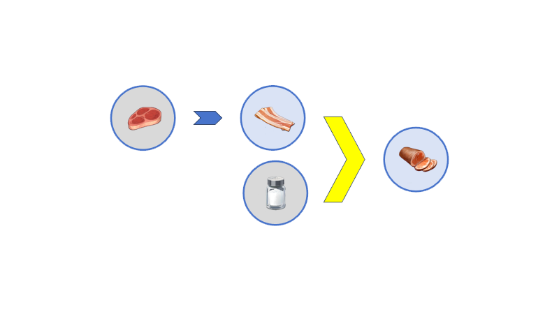
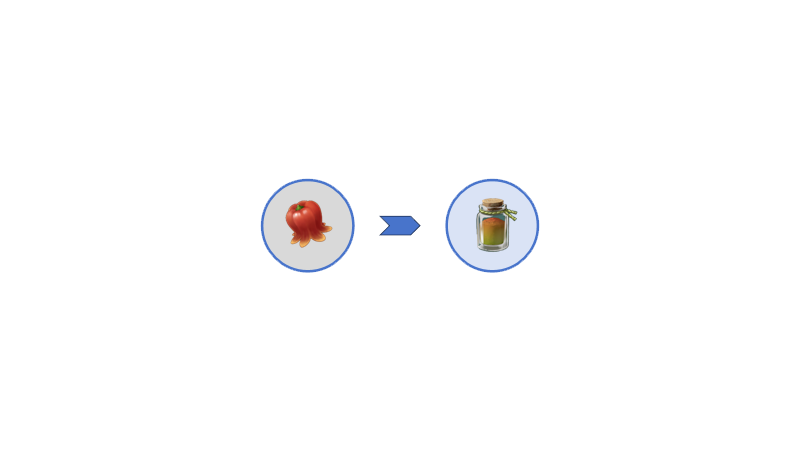
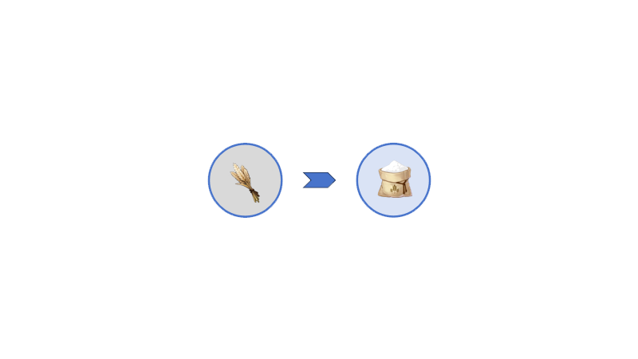
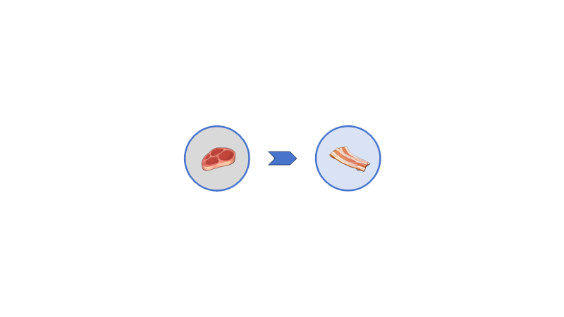
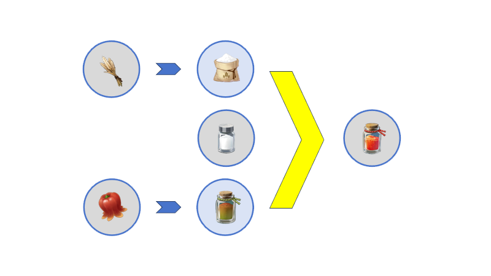

# Intermediate Product

中间产物由食材经过加工/组合等工序而来, 能够进一步合成其他中间产物或烹饪成品菜肴.

Intermediates are *processed/combined* ingredients that can be further used to make other intermediates or to *cook* finished dishes.

对了,请不要尝试将中间产物交给你的宝享用,他不会吃的噢.

By the way, please don't try to give the intermediate product to the customer, she won't eat it.

|Icon       |Name        |Recipe|
|-----------|------------|------|
| | ? ||
| | ? | |
| | ? |  |
| | ? |  |
| | ? |  |
| | ? |  |

