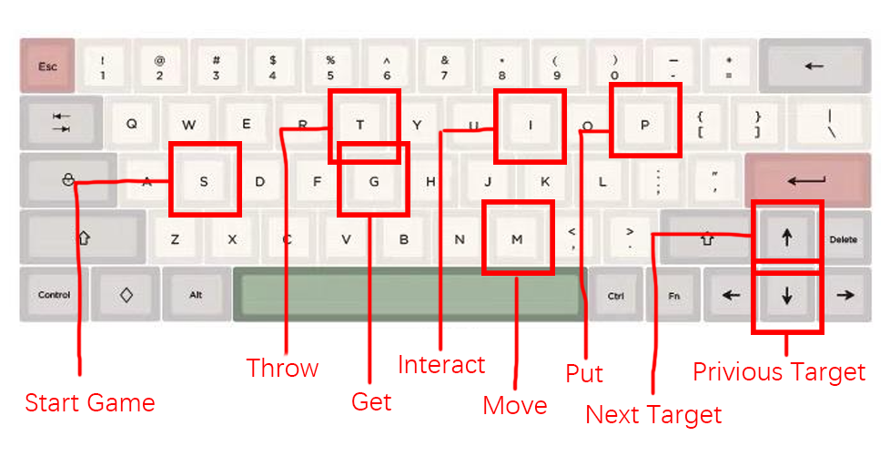

# Try with your Keyboard
为了熟悉厨房里的各项操作,你可以选择使用键盘试玩客户端. 只需要启动客户端,点击"键盘试玩"即可. 

In order to get familiar with the various operations in the kitchen, you can choose to use the keyboard to try out the client.
Just launch the client and click "Keyboard Trial".

在试玩时,键盘操作规则如下图.

In the trial play, the keyboard operation rules are as follows.

# Try the Manual demo

将开发板与电脑连接,烧写QuickStart文件夹中准备的ManualDemo.bit文件到开发板.

Connect the development board to your computer and burn the *ManualDemo.bit* file prepared in the *QuickStart* folder to the development board.

在客户端中选择合适的端口,并设置波特率为9600.

Select an appropriate port on the client and set the baud rate to 9600.

用靠右的5个大开关来控制target, 五个按钮来控制五种操作.

Use five big switches on the right to control target and five buttons to control five operations.

如果测试时,开发板的操作能正常反映到软件中,则测试成功.

If the operation of the development board can be normally reflected in the software during the test, the test is successful.

# Try the Script demo

将开发板与电脑连接,烧写QuickStart文件夹中准备的ScriptDemo.bit文件到开发板.

Connect the development board to your computer and burn the *ScriptDemo.bit* file prepared in the *QuickStart* folder to the development board.

在客户端中选择合适的端口,并设置波特率为9600.

Select an appropriate port on the client and set the baud rate to 9600.

跳过测试, 直接进入厨房. 在厨房中选择"脚本编译",并将准备好的脚本复制粘贴进客户端中.

Skip the test and go straight to the kitchen. Select "Script Compilation" in the kitchen and copy and paste the prepared script into the client.

编译脚本后,点击按钮将脚本加载进开发板,然后回到厨房界面.

After compiling the script, click the button to load the script into the development board and return to the kitchen.

单击开发板上五个按钮中靠左的那个按钮reset脚本执行器, 然后你就可以看到开发板全自动做菜了!

Click the left button of the five buttons on the development board to reset the script executive, and you can see the development board fully automatic cooking!

# Start your own design

克隆HDL框架，并遵循以下指南:

- **步骤1 通过UART的客户端协议**
发送器测试:将开发板上的预期操作正确反映到软件中的能力。这包括目标的选择和操作。
接收机测试:能正确分析软件反馈的信号，并将其反射到LED等外设上。

- **步骤2 手动准备菜肴**
通过按钮和开关将操作发送到软件客户端。
在此步骤中，您可以参考demo **ManualDemo.bit**。

- **步骤3 忽略错误**
在此步骤中，不允许以任何方式发生文件中提到的所有**非法**情况。
硬件需要有能力防止非法操作，例如，如果你试图通过按钮发出一个特殊的输入，而旅行者是移动的，硬件不应该保持' interact_operation'信号在上升沿(你可以让硬件忽略按钮输入)。

- **步骤4 使用脚本**
将提供包含脚本规范文档、脚本编译器和机器码传输协议的工具链。硬件需要能够按照预期接收、存储和运行脚本。
简单状态:在一个重置厨房里，菜肴是由一个合适的脚本自动准备的。

- **步骤5 处理异常**
在执行脚本时，厨房中未知的状态将会被脚本自动处理。任何随机厨房不可能产生非法状态，无论厨房一开始的状态有多糟糕。
复杂状态:在一个**随机**的厨房里，仍然可以自动准备不同的菜肴。

- **步骤6 最大效率!**
在重置厨房里，你可以用**任何手段**让旅行者在最短的时间内完成指定的三道菜:
“香嫩椒椒鸡，树莓水馒头，冷肉拼盘”
计时器显示的时间越少，你的分数越高!

Clone the HDL framework, and follow the guideline below:

-   **Step 1. Client protocol via UART**
    Transmitter testing: The ability to correctly reflect the expected operation on the development board into the software. This includes target selection and operation.
    Receiver test: can correctly analyze the feedback signal from the software and reflect it to the LED and other peripherals.

-   **Step 2. Manually prepare dishes**
    Use buttons and switches to send operations to the software client. 
    In this step, you can refer to the demo **ManualDemo.bit**.

-   **Step 3. Preventing illegal operations**
    In this step, all **illegal** situations mentioned in the document are not allowed to occur in any way.
    The hardware needs to have the ability to prevent illegal operations, for example, if you try to issue a special input via button while the traveler is moving, the hardware should not keep the `interact_operation` signal at a rising edge (you can ignore the input from button).

-   **Step 4. Use scripts**
    A toolchain containing a script specification document, a script compiler, and a machine code transfer protocol will be provided. The hardware needs to be able to receive, store, and run scripts as expected.
    Simple state: In a reset kitchen, different dishes are automatically prepared by a proper script.
    
-   **Step 5. Handling exception**
    When executing the script, the unknown state in the kitchen will be automatically handled by the script. 
    It is impossible for any random kitchen to produce an illegal state, no matter how bad the state of the kitchen to begin with.
    Complex state: In a **randomized** kitchen, different dishes can still be automatically prepared.

-   **Step 6. Maximum efficiency!**
    In a reset kitchen，you can use **any means** to make the traveler complete the specified three courses in the shortest time:
	`Chili Chicken, Berry Miss Manjuu, Cold Cut Platter`
	The less time the timer shows, the higher your score!

